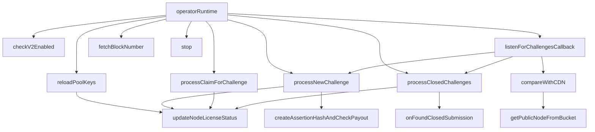
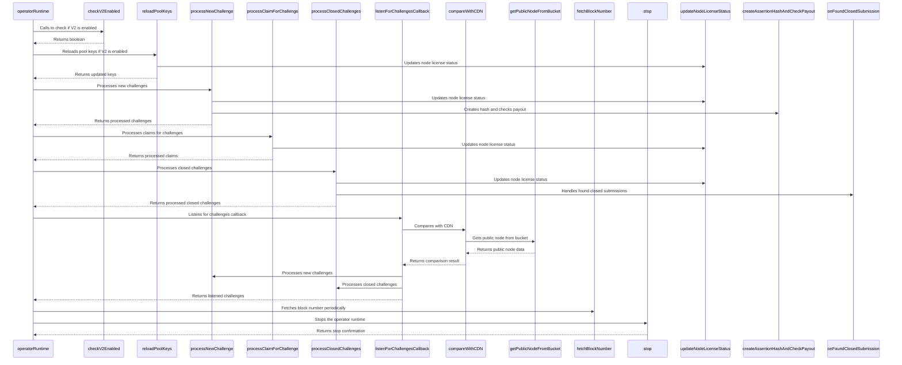

# Operator Runtime Flow Diagram

This diagram illustrates the flow and interactions within the `operatorRuntime` function and its related functions in the Sentry Core package.

```mermaid
graph TD;
    operatorRuntime --> checkV2Enabled
    operatorRuntime --> reloadPoolKeys
    operatorRuntime --> processNewChallenge
    operatorRuntime --> processClaimForChallenge
    operatorRuntime --> processClosedChallenges
    operatorRuntime --> listenForChallengesCallback
    operatorRuntime --> fetchBlockNumber
    operatorRuntime --> stop
    reloadPoolKeys --> updateNodeLicenseStatus
    processNewChallenge --> updateNodeLicenseStatus
    processNewChallenge --> createAssertionHashAndCheckPayout
    processClaimForChallenge --> updateNodeLicenseStatus
    processClosedChallenges --> updateNodeLicenseStatus
    processClosedChallenges --> onFoundClosedSubmission
    listenForChallengesCallback --> compareWithCDN
    listenForChallengesCallback --> processNewChallenge
    listenForChallengesCallback --> processClosedChallenges
    compareWithCDN --> getPublicNodeFromBucket
```
  

```mermaid
sequenceDiagram
    participant operatorRuntime
    participant checkV2Enabled
    participant reloadPoolKeys
    participant processNewChallenge
    participant processClaimForChallenge
    participant processClosedChallenges
    participant listenForChallengesCallback
    participant compareWithCDN
    participant getPublicNodeFromBucket
    participant fetchBlockNumber
    participant stop

    operatorRuntime->>checkV2Enabled: Calls to check if V2 is enabled
    checkV2Enabled-->>operatorRuntime: Returns boolean
    operatorRuntime->>reloadPoolKeys: Reloads pool keys if V2 is enabled
    reloadPoolKeys->>updateNodeLicenseStatus: Updates node license status
    reloadPoolKeys-->>operatorRuntime: Returns updated keys
    operatorRuntime->>processNewChallenge: Processes new challenges
    processNewChallenge->>updateNodeLicenseStatus: Updates node license status
    processNewChallenge->>createAssertionHashAndCheckPayout: Creates hash and checks payout
    processNewChallenge-->>operatorRuntime: Returns processed challenges
    operatorRuntime->>processClaimForChallenge: Processes claims for challenges
    processClaimForChallenge->>updateNodeLicenseStatus: Updates node license status
    processClaimForChallenge-->>operatorRuntime: Returns processed claims
    operatorRuntime->>processClosedChallenges: Processes closed challenges
    processClosedChallenges->>updateNodeLicenseStatus: Updates node license status
    processClosedChallenges->>onFoundClosedSubmission: Handles found closed submissions
    processClosedChallenges-->>operatorRuntime: Returns processed closed challenges
    operatorRuntime->>listenForChallengesCallback: Listens for challenges callback
    listenForChallengesCallback->>compareWithCDN: Compares with CDN
    compareWithCDN->>getPublicNodeFromBucket: Gets public node from bucket
    getPublicNodeFromBucket-->>compareWithCDN: Returns public node data
    compareWithCDN-->>listenForChallengesCallback: Returns comparison result
    listenForChallengesCallback->>processNewChallenge: Processes new challenges
    listenForChallengesCallback->>processClosedChallenges: Processes closed challenges
    listenForChallengesCallback-->>operatorRuntime: Returns listened challenges
    operatorRuntime->>fetchBlockNumber: Fetches block number periodically
    operatorRuntime->>stop: Stops the operator runtime
    stop-->>operatorRuntime: Returns stop confirmation
```